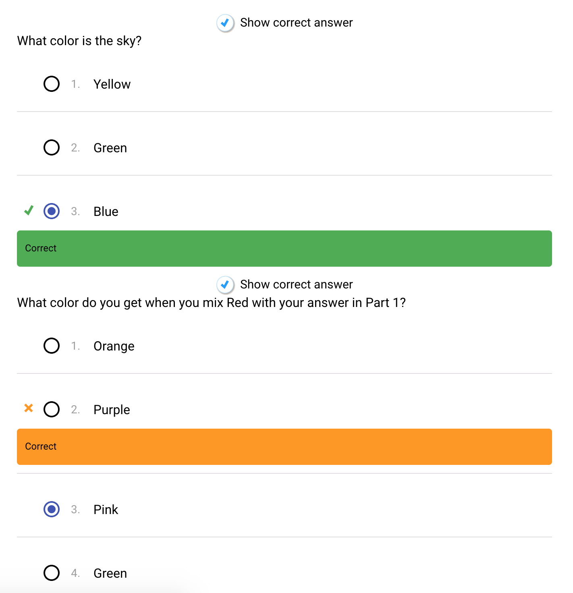

# @pie-element/ebsr


A [pie][pie] ebsr component.



## Usage 

To use this pie, you need to configure it within an Assessment Item. This means that you'll need to add it to the `index.html` and `config.json` files.

```html
<ebsr pie-id="1"></ebsr>
```

```javascript
{
  elements: {
    'ebsr': '@pie-element/ebsr@^1.0.0'
  },
  models: [
    {
      id : "1",
      element: 'ebsr',
      partA: {
        prompt : "1 + 1 equals?",
        // more configuration...
      },   
      partB: {
        prompt : "What happens when you divide by 2 your answer in Part A?",
        // more configuration...
      },
    }
  ]
```

### Pie Demo 
There is a demo in `docs/demo` that you can run to see an example of it's usage.

To preview it in that context you'll need the [pie][pie] tool.

```shell
npm install -g pie 
cd ebsr/docs/demo
pie serve # will build and serve the pie... then go to http://localhost:4000
```

## Test 

```shell 
npm test # run client and controller tests
npm run client-test # run client tests
npm run controller-test # run controller tests
```
## Release

```shell
gulp release
git checkout master
npm publish
```
[pie]: http://npmjs.org/package/pie
